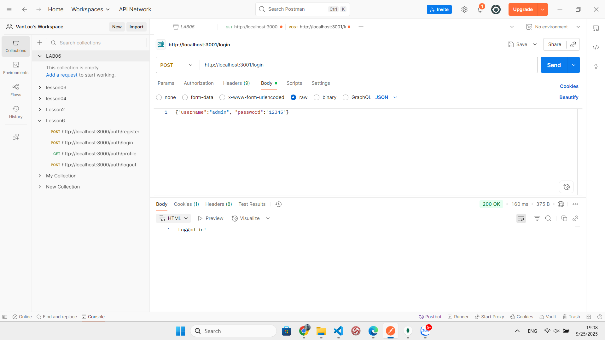

**a. node basic_auth.js.**

1. Expres: npm install express
3. Chạy dự án: node basic_auth.js
4. Kiểm tra trên postman
   Phương thức: GET
   URL: http://localhost:3000

   

**b. node cookie_auth.js:**

Hint to show cookie

Phương thức: POST
URL: http://localhost:3001/login

Show cookie in mongoDB:

